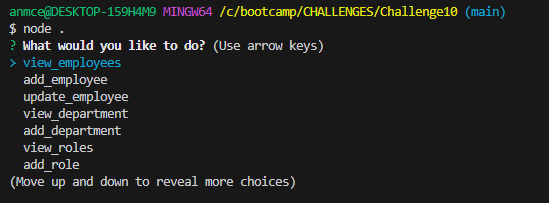
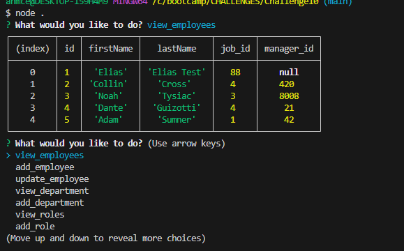

<h1># Employee Schema Database</h1>

<h2>Description</h2>

<h3>This project allows employers to keep a simple database for their employees. This tracks salary, names, departments, and roles of employees and allows the user to update any data needed with inquirer prompts</h3>

'## Click the button to watch my walkthrough video on YouTube!
'

<h2>Table of Contents</h2>

<h3> <a href=#license>License</a> </h3>
<h3> <a href=#install>Installation</a> </h3>
<h3> <a href=#usage>Usage</a> </h3>
<h3> <a href=#test>Tests</a> </h3>
<h3> <a href=#question>Contact me</a> </h3>

<h2 id="install">Installation</h2>

<h3>npm i</h3>

<h2 id="usage">Usage</h2>

<h3>node.js and mysql are required downloads for this project</h3>

<h2>Contributing</h2>

<h3>n/a</h3>

<h2 id="test">Test</h2>

<h3>npm test</h3>

<h2 id="license"><h2>License</h2>

  This project is protexted under the MIT license   
* [license](#license)
</h2>

<h2 id="question">Questions</h2>

If you have any questions you can contact me at my GitHub (1) or by email (2)

(1) [MrMcEvans] (https://github.com/MrMcEvans)

(2) anmcev70@gmail.com

